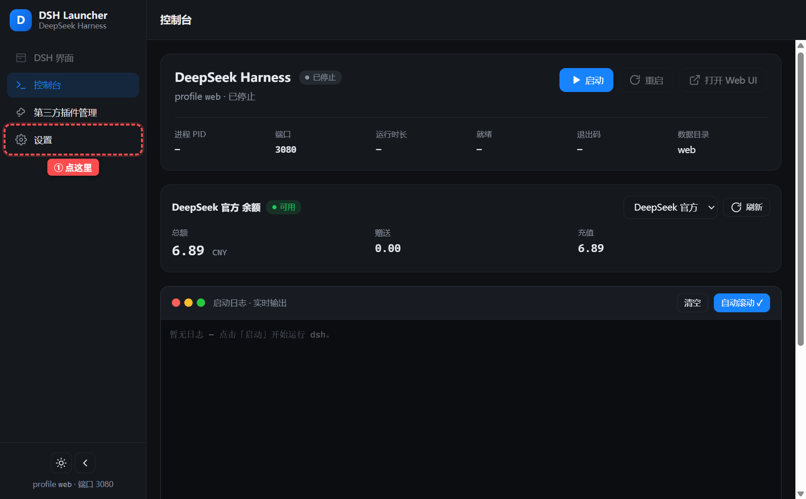
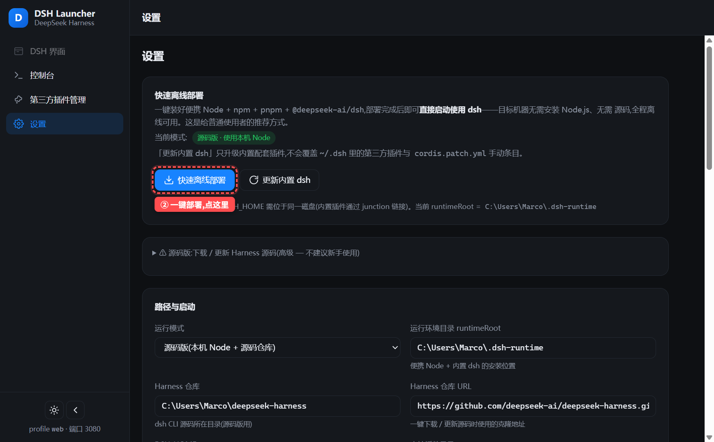
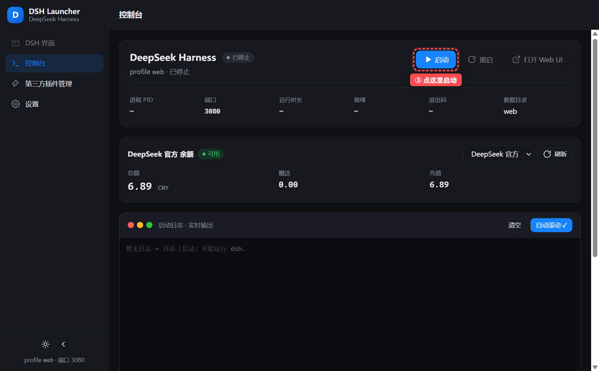
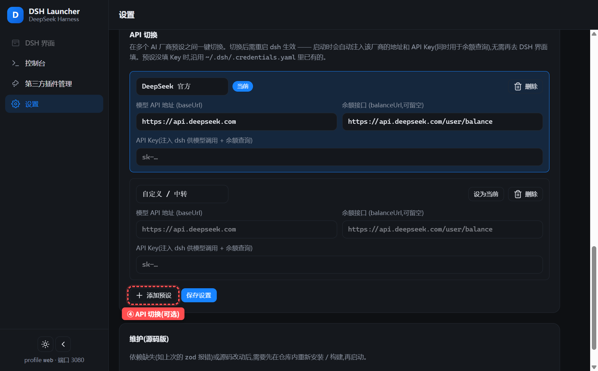

# DSH Launcher

> The most convenient DSH launcher and third-party plugin manager: one-click installation, a native client UI, and quick start & restart.

DSH Launcher is a desktop launcher for [DeepSeek Harness](https://github.com/deepseek-ai/deepseek-harness), built with Electron + React + Tailwind. It brings "install the runtime, start, restart, manage third-party plugins, and switch APIs" together into one local client.

[中文 README](README.md)

## Screenshots


## Features

- **One-click installation / quick offline deployment** — no Node.js or source code required; deploy a portable Node + dsh runtime in one click and start using dsh directly, fully offline.
- **Quick API switching** — for users who want to use non-DeepSeek APIs (cc-switch style): connect to any vendor you like and switch at any time.
- **Native client UI** — everything happens inside the desktop app; the DSH web UI can be embedded in-app (with working IME input), no browser round-trips.
- **Quick start & restart** — start / stop / restart dsh with one click; auto-enters the DSH view once it's ready.
- **Third-party plugin management** — browse local plugins, install / remove / enable / disable, one-click download from GitHub. Installed plugins are archived locally.
- **Balance widget** — check your account balance right on the dashboard.
- **Visual startup logs** — if startup fails (e.g., missing dependencies), the reason is shown in the UI with a one-click fix.

## Modes

| Mode | Description |
| --- | --- |
| Bundled (recommended) | "Quick offline deployment" installs a portable Node + dsh in one click; no prerequisites on the target machine |
| Source | Requires local Node.js + pnpm; for debugging / modifying the Harness source |

## Quick Deployment Tutorial

The target machine needs nothing to be prepared! Follow the three steps below to get dsh running.

### Step 1: Open "Settings"

After launching DSH Launcher, click **"Settings"** in the left sidebar.



### Step 2: One-click offline deployment

In the "Quick offline deployment" panel, click the **"Quick offline deployment"** button and wait for the portable Node + dsh runtime to be installed automatically (fully offline). Once deployed, the app automatically switches to bundled mode and fills in the paths.



### Step 3: Start dsh

Go back to **"Dashboard"**, click **"Start"**. Once it's ready, the app automatically enters the DSH view and you can start using it.



Need an API key? Visit the [DeepSeek open platform](https://platform.deepseek.com).

### Optional: switch API vendors in one click

In "Settings → API switching", you can add / switch AI vendor presets (DeepSeek official, relays, SiliconFlow, etc.). The preset address and API key are injected into dsh automatically at startup — no need to fill them in the DSH UI again; restart dsh after switching.



## Development & Building

```bash
pnpm install
pnpm dev        # dev mode
pnpm build      # build
```

## Privacy

- The DeepSeek API key is only read locally in the main process (the key set in Settings takes precedence; otherwise it is read from `~/.dsh/.credentials.yaml`). It is never written to logs or uploaded anywhere.

## License

MIT
