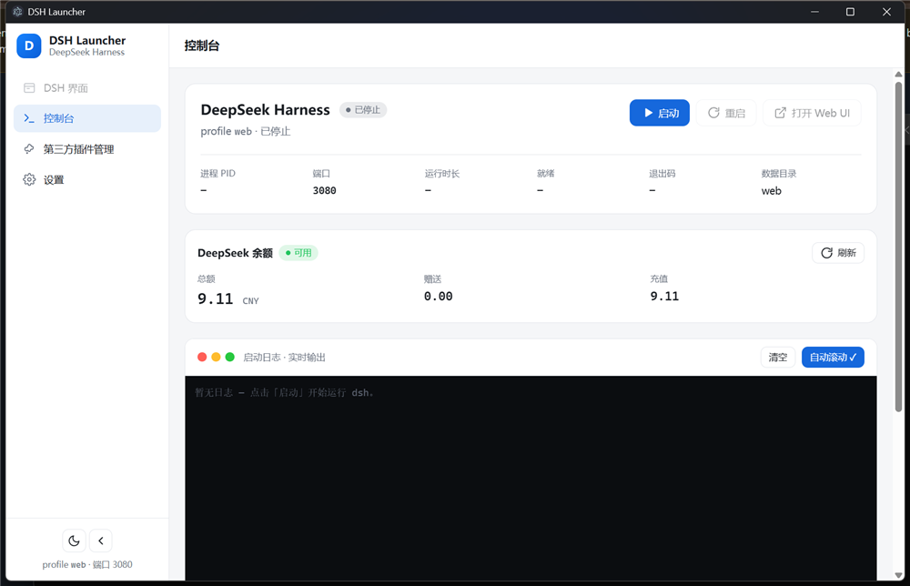

# DSH Launcher

> The most convenient DSH launcher and third-party plugin manager: one-click installation, a native client UI, and quick start/restart.

DSH Launcher is a desktop launcher for [DeepSeek Harness](https://github.com/deepseek-ai/deepseek-harness), built with Electron + React + Tailwind (UI style inspired by CC Switch). It consolidates "install the runtime, start, restart, watch logs, and manage third-party plugins" into a single local client — and when startup fails (e.g., missing dependencies), you can see why right in the UI and fix it with one click.

[中文 README](README.md)

## Screenshots



## Features

- **One-click installation / quick offline deployment** — no Node.js or source code required; deploys a portable Node + dsh runtime in one click and you're ready to use dsh directly, fully offline.
- **Native client UI** — everything happens inside the desktop app; the DSH web UI can be embedded in-app (with working IME input), no browser round-trips.
- **Quick start & restart** — start / stop / restart dsh with one click; auto-enters the DSH view once it's ready; detects external instances to avoid port conflicts.
- **Third-party plugin management** — browse local plugins, install / remove / enable / disable, one-click download from GitHub; updating the bundled dsh never overwrites your third-party plugins or `cordis.patch.yml`.
- **Balance widget** — see your DeepSeek account balance right on the dashboard; the API key is only read locally, never stored or uploaded.
- **Visual startup logs** — if startup fails (e.g., missing deps), the reason is shown in the UI with a one-click fix.

## Modes

| Mode | Description |
| --- | --- |
| Bundled (recommended) | "Quick offline deployment" installs a portable Node + dsh in one click; no prerequisites on the target machine |
| Source | Requires local Node.js + pnpm; for debugging / modifying the Harness source |

## Development

```bash
pnpm install
pnpm dev        # dev mode
pnpm build      # build
```

## Privacy

- The DeepSeek API key is only read locally in the main process (the configured key takes precedence; otherwise it is read from `~/.dsh/.credentials.yaml`). It is never written to logs or uploaded anywhere.

## License

MIT
